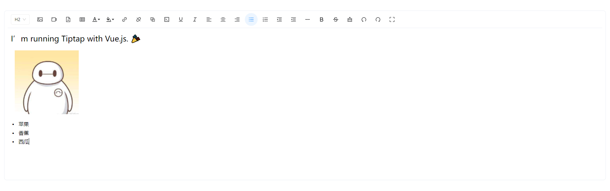

# Vue3-Tiptap ⚡

> 基于 Vue3 +Ant-Design-Vue+Tiptap 二次开发一个包含常用功能富文本编辑器

<p>
  <a href="https://htmlxudong.github.io/index.html" target="_blank" rel="noopener noreferrer">
    
  </a>
</p>

[在线预览 github](https://htmlxudong.github.io/index.html)


## 编辑器功能
- 撤销/重做
- 清除格式
- 下划线
- 图片
- 列表
- 表格
- 对齐方式
- 字体
- 标题
- 背景颜色
- 字体颜色
- 行高
- 子号
- 格式刷
- 代码块
- 查找与替换
- 粗体

- 


## 克隆代码到本地

```shell

# github
git clone https://github.com/htmlxudong/vue3-tiptap.git

# gitee
git clone https://gitee.com/xd_web/vue3-tiptap.git

```

## 安装依赖 📦

```
pnpm install or npm install

```

## 运行项目 🚀

```
npm run dev

```

## 技术栈 🥇

核心：vue3 + ant-design-vue + vite

代码提交：husky、commitlint

代码格式化：preitter

## 感谢 🌸

该项目主要借鉴于以下这些项目。

- [tiptap](https://github.com/ueberdosis/tiptap)
- [element-tiptap](https://github.com/Leecason/element-tiptap)
- [tiptap 文档](https://tiptap.dev/docs/editor/introduction)
- [prosemirror](https://prosemirror.net/)

## 更新日志 📄

- 2024.03.15 版本 1.0.0
- 2025.04.15 版本 2.0.0 使用 TypeScript 重构项目 
